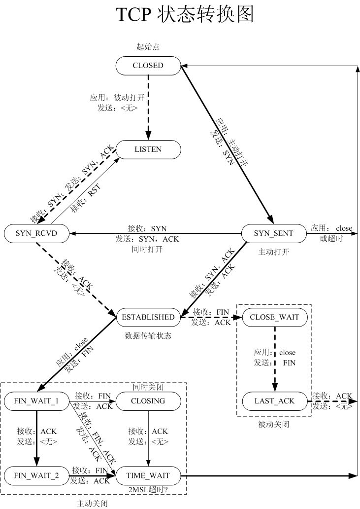

```
struct socket {  
    socket_state            state;  #枚举变量, 仅对tcp socket有用
    unsigned long           flags;  #标志位, 未使用
    const struct proto_ops *ops;    #操作函数集
    struct fasync_struct    *fasync_list;  
    struct file             *file;  
    struct sock             *sk;  
    wait_queue_head_t       wait;  
    short                   type;   #socket类型
};
```
 
 
```
 typedef enum {  
    SS_FREE = 0,            //该socket还未分配  
    SS_UNCONNECTED,         //未连向任何socket  
    SS_CONNECTING,          //正在连接过程中  
    SS_CONNECTED,           //已连向一个socket  
    SS_DISCONNECTING        //正在断开连接的过程中  
}socket_state;  
```

```
enum sock_type {  
    SOCK_DGRAM = 1,  
    SOCK_STREAM = 2,  
    SOCK_RAW    = 3,  
    SOCK_RDM    = 4,  
    SOCK_SEQPACKET = 5,  
    SOCK_DCCP   = 6,  
    SOCK_PACKET = 10,  
};  
```

```
enum {  
   TCP_ESTABLISHED = 1,  
   TCP_SYN_SENT,  
   TCP_SYN_RECV,  
   TCP_FIN_WAIT1,  
   TCP_FIN_WAIT2,  
   TCP_TIME_WAIT,  
   TCP_CLOSE,  
   TCP_CLOSE_WAIT,  
   TCP_LAST_ACK,  
   TCP_LISTEN,  
   TCP_CLOSING，  
  
   TCP_MAX_STATES  
}; sk_state  


```
  
   

